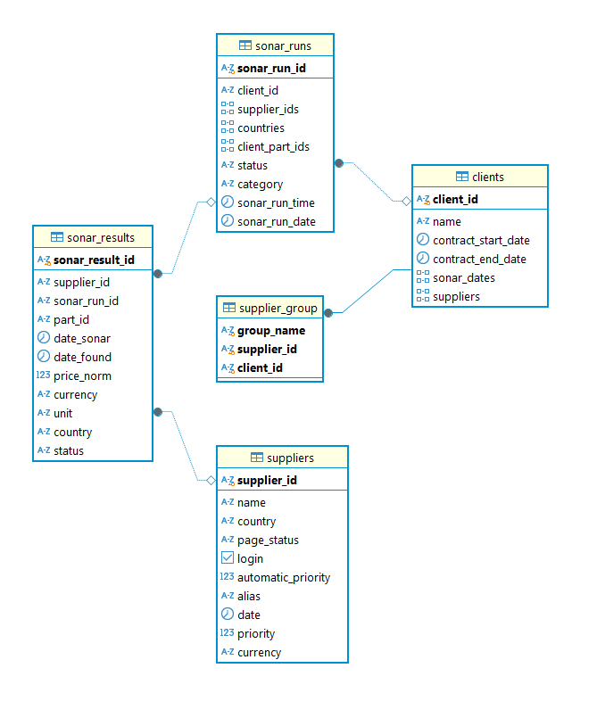
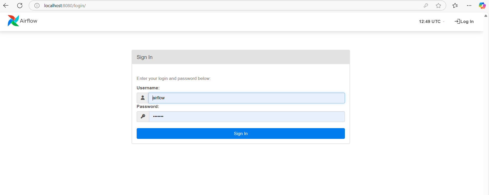
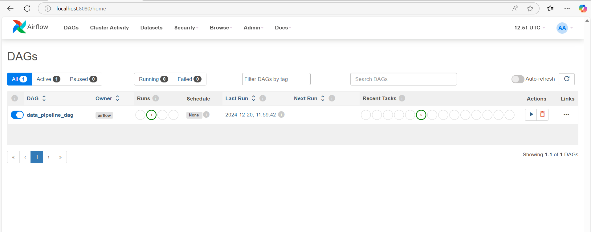
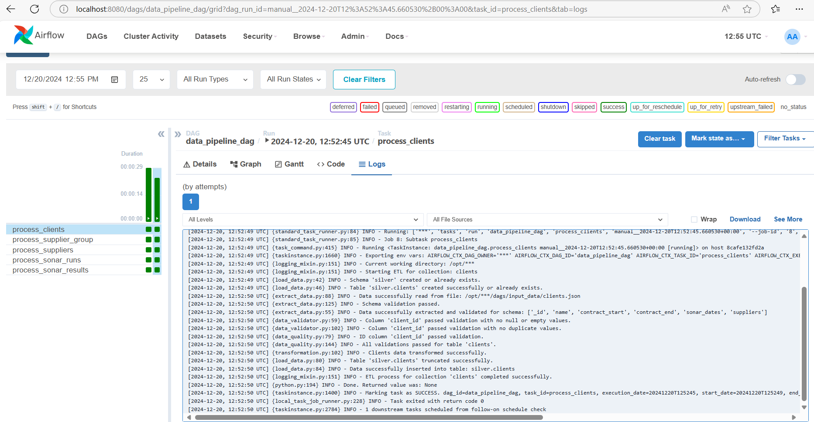
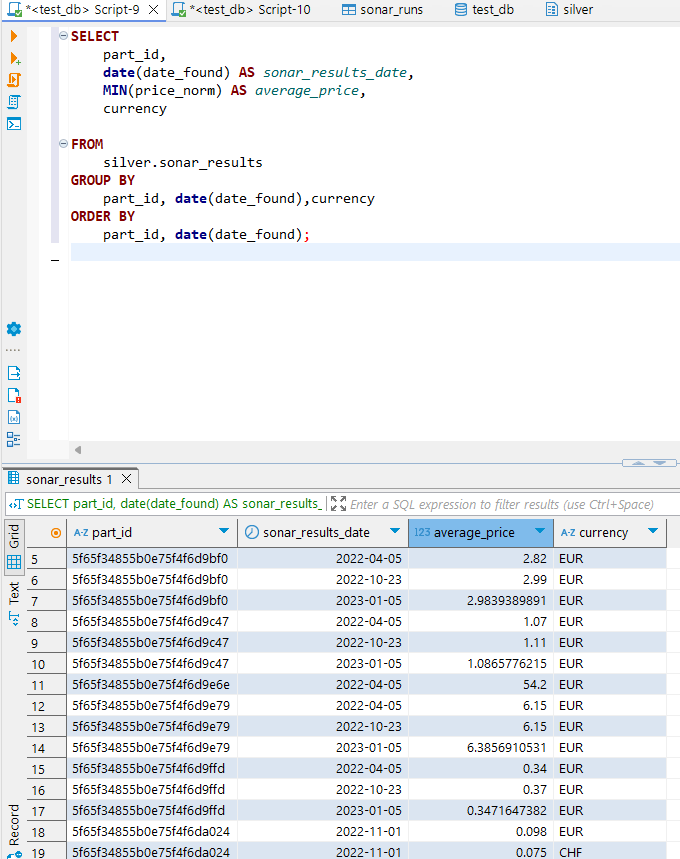

# ETL Pipeline Project with Unit Testing

## Overview
This project implements an ETL (Extract, Transform, Load) pipeline for processing the given MongoDB collections and transforming JSON data into a well-defined schema that can be loaded into a relational
database such as PostgreSQL. It includes robust unit testing to ensure the correctness of the transformations and ensure that the transformed data maintains referential integrity
and is suitable to answer analytical queries.

## Business Use Cases
Aim is to address following business questions using Postgres tables such as: 
	
- How many results do we have
  1. per part and shop?
  2. per country?
  3. per customer? 
- How did prices per part develop over time?  

---

## Assumptions

1. **Load Type**: The pipeline assumes a full load approach, meaning the data is truncated and reloaded in each run.
2. **Column Selection**: Only meaningful columns that add value for further analysis are selected from the collections. These can be adjusted in the configuration file if required.
3. **Schema Definition**: A fixed schema definition is used for the target PostgreSQL table.
4. **Golden Layer**: Semantic/Reporting layer not implemented in this Pipeline project.

---

## Pipeline Architecure

  

---

## Features
- **Data Extraction:** Reads data from MongoDb or JSON files.
- **Data Transformation:** Applies transformation logic to normalize and clean data.
- **Data Validation:** Includes checks for missing, null, or invalid data.
- **Data Loading:** Inserts transformed data into PostgreSQL tables.
- **Unit Testing:** Validates the ETL logic using sample input and expected output data.
- **Scalable Design:** Uses modular components and YAML configurations for schema definitions.

---

## Folder Structure
```plaintext
DE_Challenge/
├── dags/
│   ├── etl/
│   │   ├── data_quality_checks/  # Folder for quality checks
│   │   ├── data_validations/     # Folder for validation logic
│   │   ├── input_data/           # Folder for input data for mongo db collections
│   │   │   ├── clients.json
│   │   │   ├── sonar_results.json
│   │   │   ├── sonar_runs.json
│   │   │   ├── suppliers.json
│   │   ├── __init__.py           # Module initialization
│   │   ├── column_mappings.yml   # Mapping definitions for columns (input column names and output column names)
│   │   ├── config.yml            # Configuration file (common configuration like Postgres connection details and environment)
│   │   ├── extract_data.py       # Data extraction logic
│   │   ├── load_data.py          # Data loading logic
│   │   ├── transformation.py     # Transformation functions
│   ├── data_pipeline_mongodb_to_postgres.py # Main Airflow Dag script
│   ├── test_etl.py               # Unit testing script
├── docker-compose.yml            # Docker Compose configuration
├── Dockerfile                    # Docker image definition
├── entrypoint.sh                 # Script to set up the container environment
├── README.md                     # Project documentation
├── requirements.txt              # Dependencies

```
### Schema Understanding
- Examined the given MongoDB collections to understand their structure.
- Visualized the relationships between collections and normalized the data into PostgreSQL tables using the Entity-Relationship Diagram (ERD).
- **Entity-Relationship Diagram (ERD):**

  

#### Key Relationships Between Tables:
1. **`clients` and `supplier_group`:**
   - `clients` is linked to `supplier_group` through the `client_id`.
   - One client can have multiple supplier groups.

1. **`clients` and `sonar_runs`:**
   - `clients` is linked to `sonar_runs` through the `client_id`.
   - One client can have multiple sonar runs.

2. **`sonar_runs` and `sonar_results`:**
   - `sonar_runs` is linked to `sonar_results` using `sonar_run_id`.
   - Each sonar run can produce multiple sonar results.

3. **`suppliers` and `sonar_results`:**
   - Suppliers are referenced in `sonar_results` through `supplier_id`.
---

## Prerequisites

1. **Python**: Ensure Python 3.8+ is installed.
2. **Docker**: Docker and Docker Compose should be installed to set up Airflow.

---

## Configuration
`config.yaml` defines:
- **Schema Definitions:** SQL create table statements for each dataset.
- **Postgres configurations** Configuration of destination postgres database.

`column_mappings.yaml` defines:
- **Column Selection:** List of column select from transformed dataframe.
- **Column Mapping:** List of input column names and output column names.

---
## Setting Up the Airflow Environment

Set up PostgreSQL and ensure the credentials are added in `config.yaml` according to the environment.

1. **Clone the Repository**:
   ```bash
   git clone -b main /path/to/bundle.file </path/to/unbundle>
   cd DE_Challenge
   ```

2. **Set Up Docker Environment**:
   Build and run the Airflow environment using Docker Compose:
   ```bash
   docker-compose up -d
   ```
   

## Running the ETL Pipeline Using Airflow

1. **Start the Airflow Components**:
   Ensure the webserver and scheduler are running:
   ```bash
   airflow scheduler &
   airflow webserver &
   ```

2. **Access the Airflow Web Interface**:
   Open your browser and go to `http://localhost:8080`. Log in with the admin credentials.
   

3. **Enable the DAG**:
   Locate the `data_pipeline_dag` in the Airflow dashboard. Toggle the switch to enable it if it is not already enabled.
   

4. **Trigger the DAG**:
   Click on the play button under the **Actions** column for the `data_pipeline_dag` to start the ETL process.

5. **Monitor Progress**:
   Use the **Graph View** or **Tree View** in the Airflow interface to monitor the status of each task in the DAG. For detailed logs, click on individual task instances.
   
   
---

## DAG Characteristics

The DAG is defined with the following characteristics:

- **Owner**: The DAG is owned by "airflow".
- **Retry Configuration**:
  - Retries once on failure.
  - Retry delay is set to 5 minutes.
- **Schedule**: 
  - The DAG does not have a predefined schedule (`schedule_interval=None`). It is triggered manually or with a custom cron schedule if defined.
- **Start Date**: The DAG is effective starting December 1, 2024.
- **Catchup Behavior**: Catchup is disabled to avoid running backfill tasks for prior dates.
- **Email Notification**: Email notification not implemented yet in case of failure and sucessfull. 

---   

## Additional Notes

- Modify the configuration files (e.g., `config.yml`) to adapt to your specific requirements.
- Ensure all necessary input data files are placed in the `input_data/` directory before running the pipeline.

---

## Troubleshooting

- **Pipeline Fails**: Check the task logs in the Airflow UI for debugging information.
- **Database Connectivity Issues**: Ensure the database service is up and reachable from the Airflow environment.

---

### Unit Tests
1. Run the unit tests:
   Run following docker command to get the results of unit testing of the pipeline
   ```bash
   docker exec -it airflow-webserver pytest /app/dags/test_etl.py
   ```

---

## Implementation Details

### Data Pipeline Workflow
1. **Extraction:**
   - check file has valid json format or file name is correct or file exist on input path or not. 
   - Reads data from JSON files or other sources.
3. **Transformation:**
   - Normalizes nested JSON structures.
   - Renames and maps columns using `column_mappings` in YAML.
   - Ensures data quality (valid dates, primary key validation).
4. **Loading:**
   - Create tables if not exists.
   - Truncate existing data before loading.
   - Inserts transformed data into PostgreSQL tables.

### Data Quality and Validation
- **Null Value Check:** Ensures primary key columns have no null values.
- **Duplicate Check:** Prevents duplicate rows in the database.
- **Schema Validation:** Validates input data against schema definitions.

### Logging
- Logs are printed to the console for visibility during pipeline execution.
- Captures errors during extraction, transformation, and loading.

### Monitoring and Alerting
Future enhancements include integrating Airflow email alerts for job failures.

---

## Testing
- Each transformation function is tested using sample input and expected output.
- Tests are designed to ensure accuracy and correctness for:
  - Column renaming
  - Flattening nested JSON structures
  - Data type validation

---

## Example Use Cases
- **Clients:** Tracks customer details and contract timelines.
- **Suppliers:** Manages supplier information and priority settings.
- **Sonar Data:** Processes sonar runs and results for analysis.

### Price Trends Analysis

Using the data stored in the `sonar_results` table, we can analyze how prices for different parts evolve over time. For example:

- The query aggregates the normalized prices (`price_norm`) of parts by their `part_id` and the date they were found (`date_found`), grouped by currency. 
- By reviewing the results:
  - We observe that prices for certain parts, such as `5f65f34855b0e75f4f6d9bf0`, show fluctuations across different dates in the same currency (`EUR`). For instance, the minimum price increase from `2.82 EUR` on `2022-04-05` to `2.99 EUR` on `2022-10-23`, reflecting a upward trend.

This trend analysis enables stakeholders to identify patterns and anomalies in pricing behavior for parts over time, facilitating better decision-making in procurement, pricing strategy, and forecasting.

  

---

## Future Enhancements
- **Support for MongoDB:** Extend extraction to support MongoDB.
- **Dynamic Configuration:** Enable dynamic column mappings at runtime.
- **Comprehensive Logging:** Add support for structured logs with metadata.

---

## Contributors
- **Hassan Ali**: Designed and implemented the pipeline and unit testing framework.

---

